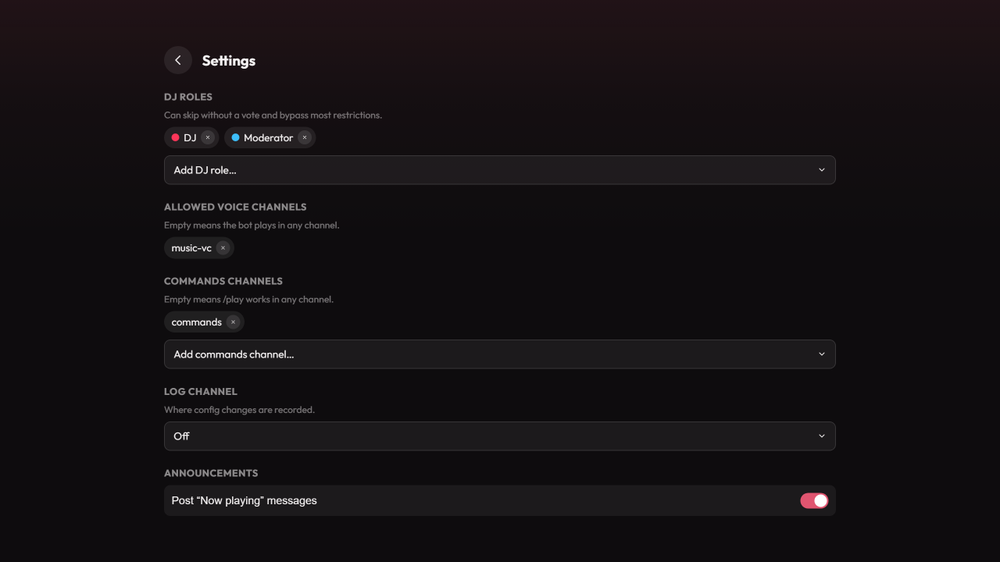

# Vibe: website

The website of [Vibe](https://playvibe.gg), a Discord music bot: the landing page, the command
reference, the legal pages, and the signed-in pages where people change their rank card, their
player and their server's settings. Plain HTML and ES modules for the pages, Node serverless
functions for the API, no build step, no framework.



Bugs, ideas and pull requests are welcome here. The bot itself is not public; this repository is
the part of the project that is.

## Run it locally, with no secrets

You need Node 22 or newer. No Discord application, database or account.

```bash
npm ci
npm run dev
```

Open <http://localhost:4321>. The real `website/api/` functions need a Discord OAuth client and a
database, so the dev server **stubs the API** with fixtures chosen for the states that are easy to
get wrong. Switch between them on any page with a query string, for example
`http://localhost:4321/dashboard?state=new`:

| `?state=` | What you see |
|---|---|
| `full` (default) | Signed in, far enough along to have badges and a part-filled level bar |
| `new` | Signed in, everything at zero |
| `signed-out` | Not signed in |
| `free` / `unsold` | Signed in without premium; premium not for sale |

The stub proves how a page renders, not how it authenticates. Auth and the endpoints are covered
by the tests.

## Tests and lint

```bash
npm run lint
npm run test:offline   # no database, runs anywhere
npm test               # also the tests that start an in-memory MongoDB
```

`npm test` downloads a MongoDB binary the first time it runs (`mongodb-memory-server`). If that is
blocked where you work, run `test:offline` and say so in your pull request instead of reporting a
pass.

## What is where

```
website/                 the site; this directory is the deploy root
  *.html, *.js, styles.css   pages and their scripts, rendered in the browser
  api/                   serverless functions (Node)
  lib/                   code the functions share: session, Discord, Mongo
  lib/generated/         GENERATED, see below
  commands.html          GENERATED, see below
  press/, badges/, fonts/    images and fonts
scripts/dev/             the dev server
tests/                   node:test files
docs/architecture.md     how the pieces fit
```

## Generated files: please don't edit them

`website/lib/generated/*` and `website/commands.html` are written from the bot's code (the command
list, the badge and level thresholds, the colour palette), which is not in this repository. They are
committed as output so the site runs on its own. If your change needs a different value in one of
them, describe it in the pull request and the maintainers will change it at the source.
Comments in the code that mention `src/` refer to that private code.

## How changes flow

The maintainers' private repository is the source of truth and this one is a mirror of the website
part of it. A merged pull request here is re-applied there by a maintainer, and the next
publish carries it back, so the history you see here may be rewritten when that happens. Nothing you
send is lost by it. Please don't build long-lived forks on the assumption of a stable history.

## Licence

The code is [MIT](LICENSE). That covers everything except the items below.

- **The Vibe name, the logo and the images in `website/press/` and `website/badges/`** are the
  project's brand. They are here so the site renders, not as a licence to reuse them: don't use them
  to present another bot or service as Vibe. Artwork is planned to live in its own repository with
  its own licence; when it does, that repository's terms apply to these images.
- **Outfit** (`website/fonts/`) is by The Outfit Project Authors under the SIL Open Font License 1.1
  ([`website/fonts/OFL-Outfit.txt`](website/fonts/OFL-Outfit.txt)).

## Security

Please report a vulnerability privately, not in an issue: see [SECURITY.md](SECURITY.md).
