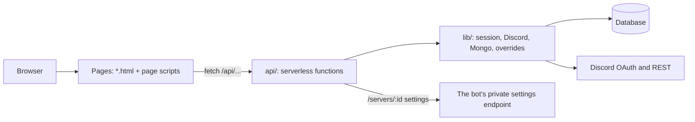

# Architecture

How the website is put together. For running it, see the [README](../README.md); for the auth model,
the environment variables and the database access, see [`website/README.md`](../website/README.md).

## Shape

Static pages, a handful of serverless functions, and no build step. The site is deployed with
`website/` as its root, which explains most of the layout: **nothing outside `website/` is in the
deployed bundle, so nothing inside it can import from outside.**

- **Pages** (`website/*.html`, `dashboard.js`, `servers.js`, `dash/`, `nowplaying/`) are rendered in
  the browser from JSON the API returns. They use plain ES modules.
- **`website/api/`** holds one function per endpoint: sign-in and sign-out (`auth/`), the profile,
  the appearance settings, the passport, the list of servers a person administers, and one server's
  settings. Each checks the session first, and re-checks server permissions against Discord on every
  request rather than trusting the cookie.
- **`website/lib/`** is what the functions share: the encrypted cookie session (there is no session
  store), the Discord client, the MongoDB connection, and the list of per-server overrides a site
  user may change.
- **`website/lib/generated/`** and **`website/commands.html`** are generated from the bot's code (the
  command list, badge and level thresholds, colours) and committed as output. They are not edited
  here.

## Two rules the design follows

1. **The site writes only what a signed-in person changes about themselves or a server they
   administer.** Listening statistics, history, playlists and the shared server config belong to the
   bot; a second writer would mean a second set of rules about them.
2. **Server settings go through the bot, not around it.** The site calls a private endpoint of the
   bot with a shared secret, so the website holds no bot token and the bot's own validation is the
   only validation of a setting.

## The dev server

`scripts/dev/website-dev-server.js` serves `website/` and replaces `api/` with fixtures, so pages
can be worked on without Discord, a database or a secret. It shows how a page renders, not how it
authenticates. The tests in `tests/` call the real functions with a fake request and, for the
database ones, an in-memory MongoDB.
